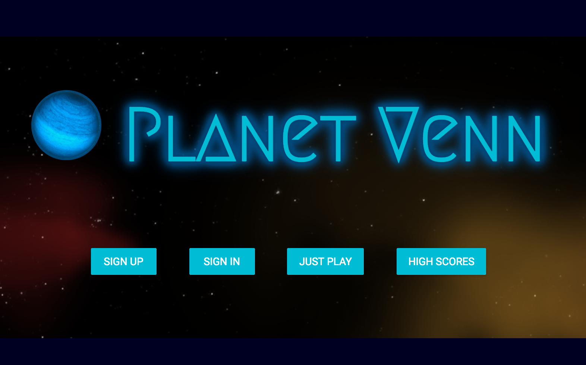
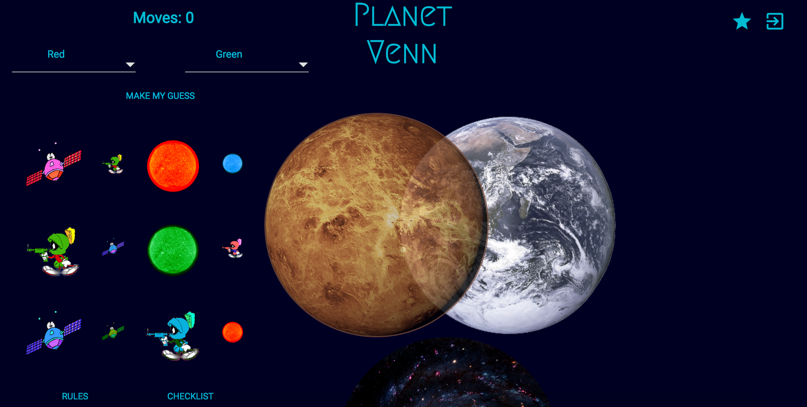

# PLANET VENN #

Please visit and play our live application @ https://morning-hamlet-93020.herokuapp.com/

***A logic-based educational game that is really fun to play!***

##CONTENTS##

[Video Demonstration](#demo)

[Home Screen/Landing Page](#home)

[What everything is on the Game Page](#gamescreen)

[How to play/win](#gameplay)

## Video Demostration ##

## Home Screen / Landing page ##

On the initial page with our name and logo you can **Sign Up** *(To be able to track your progress and post a high score if you get it.)*, **Sign In** *(same as above)*, **Just Play** *(Play a game right away, but nothing will be saved)*, and **View High Scores**.

## Game Screen ##

In the game you will notice several components.  The **Moves** component keeps track of every move you have made.  Correct piece placements, incorrect piece placements, and guessing the rules all increase the moves by 1. If you move a piece that has already been correctly guessed, that does not increase the move counter.

The ***RULES*** *(lower-left tab)* link will show you in detail how to play the game.

Clicking on the ***CHECKLIST*** *(lower-left tab)* will allow you to place checkmarks according to what you think is correct and incorrect. (Optional)

***Star icon*** *(top right)*: Clicking this will show your previous scores to keep track of your progress.

***Box with arrow icon*** *(top right)*: Clicking this will take you back to the initial home screen.

## Game Play ##
The ***Pieces*** *(on the left-hand side that include aliens, suns, and satellites)*, are draggable.  Click on a piece and try to figure out where that piece should go.  If you correctly place it, the piece will animate.  If it is not correct, it will return to it's starting position.

The ***Planets*** *(top 2 planets in the center that overlap)* are the what the rules are correlated to.  A correct piece placed will be animated.

The ***overlapping planet section*** is where a piece meets criteria for *both* rules.

The ***Blackhole*** is where pieces are placed that do not meet either rule.  *FUN NOTE: After a game is won, any piece placed in the blackhole will slowly spin and get smaller as it gets sucked away into the black hole*.

Once you think you know both rules, click on the dropdown boxes (just underneath the Moves component).  Then click *Make My Guess*.  If you corectly guessed the rules, then you have won the game.  If not, keep playing/guessing until you do win.  These notes will show on the lower center part of the screen.  If you won, and your scores is one of the top scores, it will be saved to the top scores and to your history (star icon on upper right of screen).  **NOTE:** These will only save if you have signed in.  If you clicked Just Play on the home screen, then your info is not saved.

___

***GOOD LUCK AND HAVE FUN***:exclamation::exclamation::exclamation:
